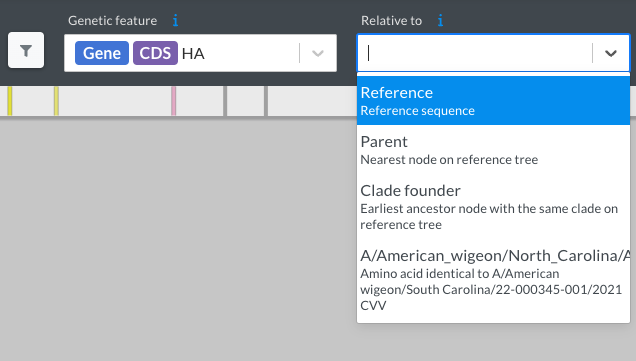

# Identifying HA mutations in a new sequence

H5Nx influenza is a persistent threat to public health, so it's important to continuously surveil for mutations in H5 that could enhance its ability to infect humans. Thanks to help from [Louise Moncla](https://lmoncla.github.io/monclalab/) and [Jordan Ort](https://lmoncla.github.io/monclalab/team/JordanOrt/), you can easily connect H5 HA mutations identified with [Nextclade](https://clades.nextstrain.org/) to their effect on H5 stability, cell entry, receptor usage, and antigenic escape. Here's how:

[Nextclade](https://clades.nextstrain.org/) is a software tool that performs clade assignment, mutation calling, and sequence quality checks on viral sequences. After providing your viral sequences as a `.fasta` file, Nextclade recommends a relevant 'dataset' consisting of a curated phylogeny, reference sequence, gene annotation file, and metadata. The output of Nextclade, including viral mutations, can be downloaded for downstream applications.

1. Prepare and upload a `.fasta` file of your viral sequences.

2. Select the appropriate reference dataset. We currently support only the `H5Nx clade 2.3.4.4` dataset, which includes a sequence (`A/American_wigeon/North_Carolina/AH0182517/2022`) identical in **amino acid** sequence to the parental H5 HA sequence used to design our DMS library (`A/American Wigeon/South Carolina/USDA-000345-001`).

3. Identify mutations relative to the parental H5 HA sequence. By default, mutations are identified relative to the reference sequence of the `H5Nx clade 2.3.4.4` dataset (`A/Astrakhan/3212/2020`). To change this, select `A/American_wigeon/North_Carolina/AH0182517/2022` from the `Relative to` drop down menu:

    

4. Download the mutations identified by Nextclade. Select the `nextclade.csv` file under the `Export` tab. Amino acid mutations relative to the parental strain will be in a column called `relativeMutations['A/American_wigeon/North_Carolina/AH0182517/2022'].aaSubstitutions` in the following format:

    ```text
    HA:V11I,HA:T52A,HA:M120L,HA:A156T,HA:A226V,HA:K341R,HA:N491D,HA:V526I
    ```

    **Note**, the `aaSubstitutions` column still only has the mutations relative to the default Nextclade reference strain (`A/Astrakhan/3212/2020`).

5. Convert between HA numbering schemes. The HA mutations from Nextclade are numbered **sequentially**. This is equivalent to the `sequential_site` column in our [`site_numbering_map.csv`](https://github.com/dms-vep/Flu_H5_American-Wigeon_South-Carolina_2021-H5N1_DMS/blob/main/data/site_numbering_map.csv). The file [`site_numbering_map.csv`](https://github.com/dms-vep/Flu_H5_American-Wigeon_South-Carolina_2021-H5N1_DMS/blob/main/data/site_numbering_map.csv) provides a way to convert between Nextclade's sequential site numbering and other HA formats. For a detailed explanation of HA numbering, refer to [this page](./numbering.md).

6. Search for the effect of mutations in our data. Mutations in our data are numbered using the widely adopted H3 numbering scheme, as shown in the `reference_site` column in [`site_numbering_map.csv`](https://github.com/dms-vep/Flu_H5_American-Wigeon_South-Carolina_2021-H5N1_DMS/blob/main/data/site_numbering_map.csv). First, convert mutations to the H3 numbering scheme (`sequential_site` → `reference_site`), then explore their phenotypes using our [interactive summary plots](./summary.md).
