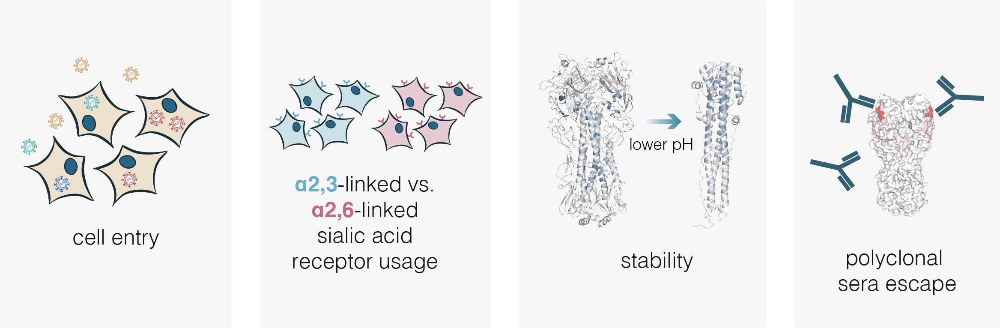

## About this site
This website contains interactive plots and numerical results from [pseudovirus deep mutational scanning](https://doi.org/10.1016/j.cell.2023.02.001) experiments that measure the effects of mutations to the hemagglutinin (HA) of the 2.3.4.4b clade strain A/American Wigeon/South Carolina/USDA-000345-001/2021 (H5N1) on several key molecular phenotypes.
This study was led by Bernadeta Dadonaite in the Bloom lab.

The links in the boxes above take you to interactive plots or descriptions of different aspects of the study.
For a high-level overview, see the [summary](summary){target="_self"} of how mutations affect all phenotypes.
To delve into the data in more detail, click on the boxes above for each individual phenotype.

You can also examine the output of the full [computational pipeline](pipeline_information){target="_self"} and look at the underlying code [on GitHub](https://github.com/dms-vep/Flu_H5_American-Wigeon_South-Carolina_2021-H5N1_DMS).
[Here is a CSV file](https://github.com/dms-vep/Flu_H5_American-Wigeon_South-Carolina_2021-H5N1_DMS/blob/main/results/summaries/phenotypes.csv) of the numerical values of the measurements with pre-filtering for high-confidence values.

Note the experiments use [single-cycle replicative pseudoviruses that can be safely studied at biosafety-level 2](experiments_and_biosafety){target="_self"}.

## HA phenotypes measured in this study
This study measures how mutations affect four HA phenotypes:
 - *HA-mediated entry into 293T cells*: positive values indicate better entry than the parental HA, negative values indicate impaired entry.
 - *HA stability*: positive values indicate greater stability (tolerance to more acidic conditions) than the parental HA.
 - *a2,6 sialic acid usage*: positive values indicate improved usage of a2,6 sialic acids.
 - *Escape from serum antibody neutralization*: positive values indicate reduced neutralization by serum, negative values indicate more neutralization.

