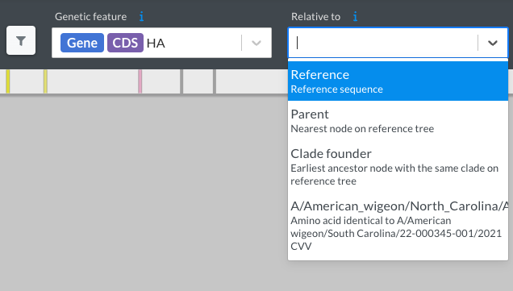

# Summary of how mutations affect all measured phenotypes

## Interactive plot of all phenotypes
The plot below shows how mutations affect all the measured phenotypes, and allows you to zoom and mouseover sites and mutations. 
Click on the expansion box in the upper right of the plot to enlarge it for easier viewing, or [click here](/htmls/phenotypes_faceted.html){target="_self"} to open the plot in a stand-alone window.
Note that the two different shades of gray in the heatmaps have differing meanings: light gray means a mutation was *missing (not measured)* in the library, whereas dark gray means a mutation *was measured but was so deleterious for cell entry* it is not possible to reliably estimate its effect on other phenotypes (the threshold for how deleterious a mutation must be for cell entry to be shown in dark gray is controlled by the cell entry slider at the bottom of the plot).

<Figure caption="Interactive plot showing effects of mutations on all phenotypes">
    <Altair :showShadow="true" :spec-url="'htmls/phenotypes_faceted.html'"></Altair>
</Figure>

Here is an explanation of the key plot elements:
 - The zoom bar at the top of the plot shows different regions of HA, and can be used to zoom in on specific sites.
 - The line plots summarize the average escape from neutralization by sera from different species in black at top, and then below that in gray the escape for sera from each species (averaged across animals; see the [serum escape page](escape){target="_self"} for per-animal escape). The height of each line summarizes the total escape caused by mutations at each site using the *site escape statistic* specified by the interactive options at the bottom of the plot.
  - The heatmaps show how each individual mutation affects each phenotype. The `x`'s indicate the amino-acid identity in the parental HA strain, light gray indicates mutations that were not measured, and dark gray indicates mutations that are filtered out by one of the interactive sliders at the bottom of the plot (eg, they have a very negative effect on cell entry). You can mouse over any of the points for details.
  - The options at the bottom of the plot allow you to interactively adjust what is displayed. For instance, the *minimum mutation entry in 293T cells* only shows mutations with at least some minimal cell entry function (and grays out mutations that are more deleterious). You can also select to only show mutations accessible by some number of mutations to the codon in the parental sequence (eg, only accessible by single-nucleotide mutations), or floor the escape at zero to show / not show "negative" escape values.

HA genes are numbering various different ways; see [here](numbering) for an explanation of the numbering scheme used here.

## Structure-based visualization
To view the effects of mutations in the context of the H5 HA three-dimensional structure, use [this dms-viz link](https://dms-viz.github.io/v0/?data=https%3A%2F%2Fraw.githubusercontent.com%2Fdms-vep%2FFlu_H5_American-Wigeon_South-Carolina_2021-H5N1_DMS%2Fmain%2Fresults%2Fdms-viz%2Fdms-viz.json).

## Numerical values of mutation effects on all phenotypes
The numerical data plotted above are in [this CSV file](https://github.com/dms-vep/Flu_H5_American-Wigeon_South-Carolina_2021-H5N1_DMS/blob/main/results/summaries/phenotypes.csv).
These data have been to retain only higher-confidence values.
For more detailed data without the pre-filtering, see the phenotype-specific pages.

## H5 Surveillance with [Nextclade](https://clades.nextstrain.org/)

Thanks to help from [Louise Moncla](https://lmoncla.github.io/monclalab/) and [Jordan Ort](https://lmoncla.github.io/monclalab/team/JordanOrt/), you can easily connect H5 HA mutations identified with [Nextclade](https://clades.nextstrain.org/) to their effect on H5 stability, cell entry, receptor usage, and antigenic escape. Here's how:

[Nextclade](https://clades.nextstrain.org/) is a software tool that performs clade assignment, mutation calling, and sequence quality checks on viral sequences. After providing your viral sequences as a `.fasta` file, Nextclade recommends a relevant 'dataset' consisting of a curated phylogeny, reference sequence, gene annotation file, and metadata. The output of Nextclade, including viral mutations, can be downloaded for downstream applications.

1. Upload a `.fasta` file of your viral sequences.

2. Select the appropriate reference dataset. We're only supporting the `H5Nx clade 2.3.4.4` dataset, which contains the parental H5 HA sequence used to design our DMS library (`A/American Wigeon/South Carolina/USDA-000345-001`).

3. Identify mutations relative to the parental H5 HA sequence. By default, mutations are identified relative to the reference sequence of the `H5Nx clade 2.3.4.4` dataset (`A/Astrakhan/3212/2020`). Change this by selecting the DMS strain in the `Relative to` drop down menu:

    

4. Download mutations identified by Nextclade. Select the `nextclade.csv` file under the `Export` tab. Amino acid mutations relative to the parental strain will be in a column called `relativeMutations['A/American_wigeon/North_Carolina/AH0182517/2022'].aaSubstitutions` in the following format:

    ```text
    HA:V11I,HA:T52A,HA:M120L,HA:A156T,HA:A226V,HA:K341R,HA:N491D,HA:V526I
    ```

5. Convert between HA numbering schemes. The HA mutations from Nextclade are numbered sequentially. This is equivalent to the `sequential_site` column in our [`site_numbering_map.csv`](https://github.com/dms-vep/Flu_H5_American-Wigeon_South-Carolina_2021-H5N1_DMS/blob/main/data/site_numbering_map.csv).

6. Look up mutations in our DMS datasets. [Here is a CSV file](https://github.com/dms-vep/Flu_H5_American-Wigeon_South-Carolina_2021-H5N1_DMS/blob/main/results/summaries/phenotypes.csv) of the numerical values of the measurements with pre-filtering for high-confidence values. In this file, the `site` column refers to the `reference_site` column in our [`site_numbering_map.csv`](https://github.com/dms-vep/Flu_H5_American-Wigeon_South-Carolina_2021-H5N1_DMS/blob/main/data/site_numbering_map.csv).

## Explore Mutation Effects

Explore the effects of mutations on the phenotypes measured in this experiment using the interactive tool below. Search for mutations (or sites) by entering them as a comma-separated list in the `Mutations:` search bar (e.g., H110Y, H110S). Lines indicating the effects of each mutation are displayed on a histogram of all mutation effects for the phenotype selected from the `Phenotypes:` menu. Below the histogram, an interactive table displays data associated with each mutation.

The default numbering scheme is for H3; however, you can select your preferred numbering scheme using the `Select numbering scheme:` menu.

<iframe width="100%" height="915" frameborder="0"
  src="https://observablehq.com/embed/@willhannon-mcb/h5n1-dms-phenotype-lookup@251?cells=viewof+numberingScheme%2Cviewof+sites%2CtransposedSitesString%2Cviewof+phenotype%2Cplot%2Cfilter_df"></iframe>